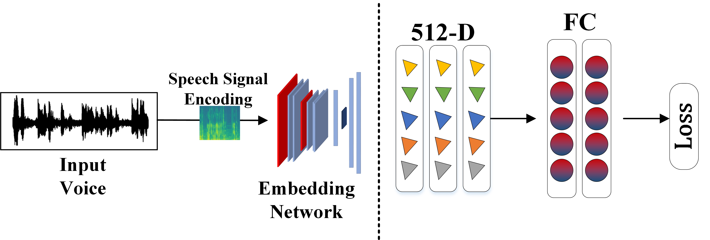

# Speaker Emotion Recognition
Our aim is to learn a discriminative embedding that is amenable to an emotion recognition task. Following Fig. shows the proposed emotion recognition framework leveraging \textit{pretrain-then-transfer} learning paradigm. First, it trains a speaker recognition network on a large-scale dataset with an aim to obtain a robust feature extractor. Afterwards, voice embeddings are extracted using this pre-trained network to train a simple two-layer multilayer perceptron with a softmax to classify speaker emotions.

